### RISC-V Software Porting and Optimization Championship P2308


## 赛事介绍

#### 官网：https://rvspoc.org/

#### FAQ：https://rvspoc.org/faq/

#### 工作邮箱：rvspoc@cyberlimes.cn

#### 讲解主题：Xv6 移植和演示


#### RVSPOC 组委会 孙敏
<br /><br /><br /><br /><br /><br /><br /><br /><br /><br /><br /><br /><br />

## P2308 赛题描述


本项目要求将 Xv6 移植到 Milk-V Duo 上，并能通过串口进行交互，能够完成基本外设的使用，编译并运行系统和外设测试示例。

## 产出及评分要求

1. 能够在 Milk-V Duo 上运行基础的 Xv6，默认支持中断处理，UART 通讯等功能。
2. 支持基础外设驱动主要包括 UART、GPIO、I2C、SPI、ADC、PWM 并编写相应示例。
3. （加分项）支持 mailbox 驱动，并编写与大核的通讯示例。

**验证平台：Duo**


## 内容介绍


* 硬件与开发环境准备

* Xv6 riscv 简介

* Xv6 riscv 开发板移植现状 

* Xv6 riscv on qemu

* 总结

<br /><br /><br /><br /><br /><br /><br />

## 环境准备

- X86 Host 主机 （WSL On Win10）

- Duo 开发板 （64MB） + 串口线 （USB转串口线）

- Xv6 riscv 源码 

- Xuantie C900 工具链，需要下载带***newlib*** 字样的

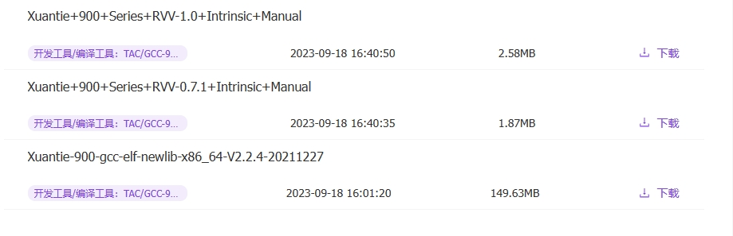

https://www.xrvm.cn/community/download?id=4224193538625179648

- Xuantie qemu

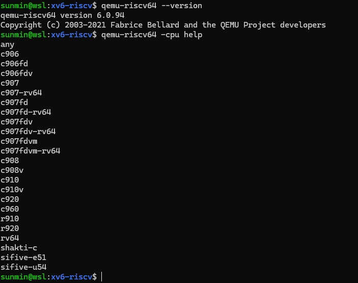

https://www.xrvm.cn/community/download?id=4239362973702885376


## Xv6 riscv 简介

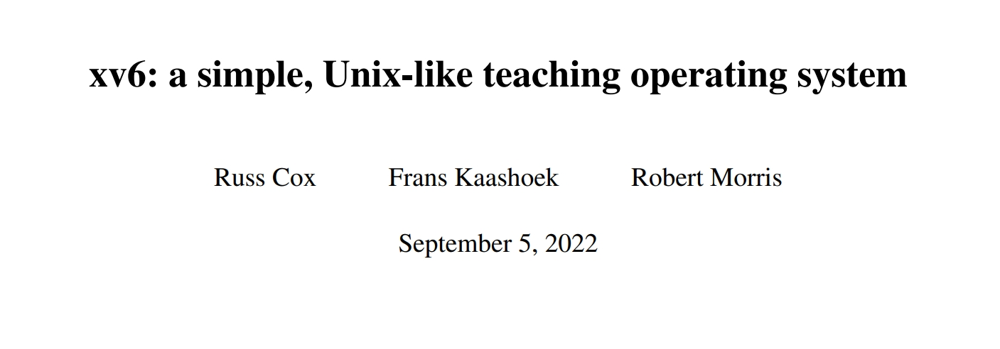

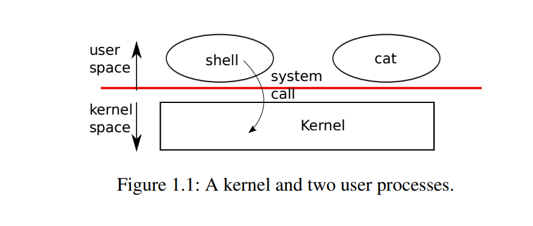

https://pdos.csail.mit.edu/6.828/2023/xv6/book-riscv-rev3.pdf

### 内核特性 （kernel space）

- 64 Bit RISC-V 
- SMP: Shared Memory Multiprocessor 
- 进程： 行为(fork)，状态(sleep)
- 虚拟地址空间-页表
- 文件 文件夹
- Pipes
- 多任务 (时间片)，非RTOS
- 21 个系统调用接口

### 外设

- 磁盘 Disk
- UART
- 时钟中断 PLIC + CLINT

### 内存管理

- :white_check_mark:  Sv39(三级页表)  :x: Sv32 :x: Sv48 
- Page Size 4096 bytes
- :x: variable sized allocation
- :x: malloc
- one table per-process 

- 最高寻址范围 0~256 Gigabytes 
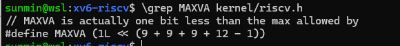

### 调度器

round robin 顺序执行各个runnable进程
 
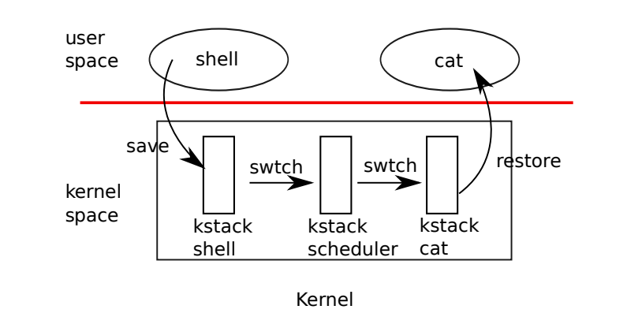

### boot loader （qemu）

-  boot loader 把kernel.bin 加载到物理地址 0x80000000


### 系统调用明细
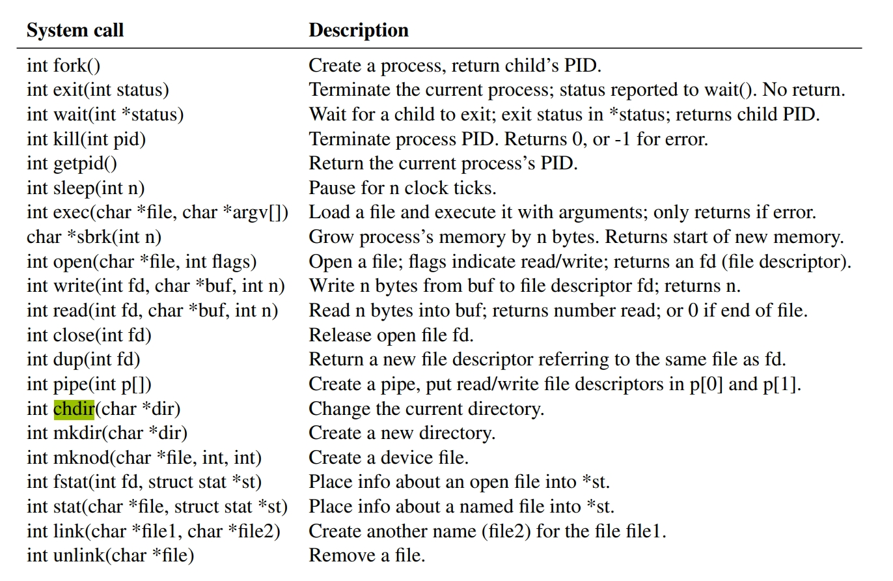


### 应用程序 user space

应用程序

| 名称  | 简介                                 | 名称| 简介    |
| -------- | ----------------------------------- | ------------------- | ----------- |
| sh    | shell 程序                      |  cat             | 文本查看  |
| echo    | 控制台打印序                      |  grep             | 关键字搜索  |
| kill    | 终止进程                      |  ln             | 链接文件  |
| ls    |  查看文件列表                      |  mkdir             | 文件夹创建  |
| rm    | 删除文件                      |  wc             | 单词统计  |

### 缺失的特性

- 用户 ID，登录/退出
- 文件保护机制 (rwx)
- 文件挂载
- 内存交换 (swap)
- Sockets
- 进程间通信 （sync)
- 常见的外设驱动 (RJ45,USB,RNDIS)
- 常见的应用程序 (cd,sleep)

https://www.youtube.com/watch?v=fWUJKH0RNFE


## Xv6 riscv 开发板移植现状

### 开发板支持情况

1. K210

2. 某 D1 的开发板
https://github.com/michaelengel/xv6-d1/blob/main/README_D1.txt
https://multicores.org/slides/xv6-riscv.pdf 

3. FPGA
 https://github.com/x653/xv6-riscv-fpga

4. :x: Milk-v Duo


### Xv6 riscv qemu 与 Duo 板载资源对比
| 名称  | qemu                                 | Duo| 备注    |
| -------- | ----------------------------------- | ------------------- | ----------- |
| CPU    | RV64 支持多核                      |  RV64 单核             |   |
| RAM    | 128 Mbytes                      |  64 Mbytes              |   |
|UART|串口   |  真实串口             |   |
|文件系统| Host 磁盘   |  SD 卡              |   |
|时钟 中断| 虚拟时钟，虚拟中断   |  物理时钟，真实中断             |   |
|SPI接口| :x:   |  :white_check_mark:              |   |
|TPU| :x:   |  :white_check_mark:              |   |
|GPIO,RJ45| :x:   |  :white_check_mark:              |   |
|USB、RNDIS| :x:   |  :white_check_mark:              |   |


### Duo 平台移植挑战

* UART
* 时钟 PLL 中断 异常处理
* 外设 GPIO， Spi 相机， Spi Nand， SDcard  RJ45， USB
* 内存管理 MMU 脉冲宽度调制PWM

### Duo 平台移植内容(参考)

- kernel (uart)

- system call

- user program

- 生成 SD Image 镜像
支持 dd，rufus 等工具刷写镜像到 SD 卡

- 支持 UART 双向通信

- 进一步移植其它外设(加分项)


## Xv6 riscv on qemu

### qemu-riscv64 虚拟串口

- qemu 模拟了一款串口芯片 16550

```
kernel/uart.c
```

- xv6 串口驱动

```
 kernel/console.c
```

http://bitsavers.trailing-edge.com/components/national/_appNotes/AN-0491.pdf

- xv6 console的输入，输出都是通过模拟串口实现的

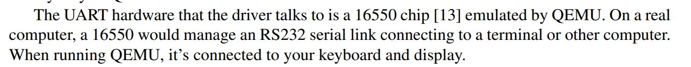

### xv6-riscv qemu 环境准备

* 获取 xv6-riscv  代码 
    ```
    git clone https://github.com/mit-pdos/xv6-riscv.git
    ```

* 指定交叉编译器路径
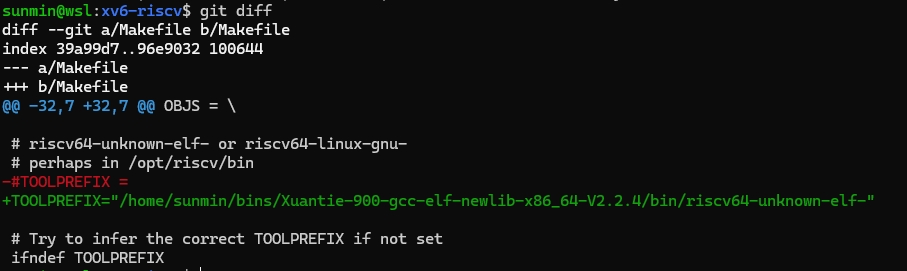

* 查看 xv6 qemu target
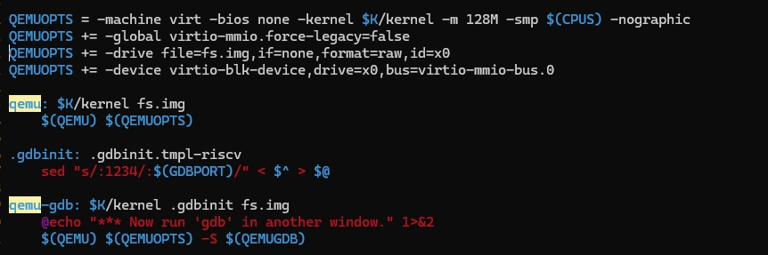


* 编译/运行 xv6 qemu

    ```
    make qemu -j1
    ```
    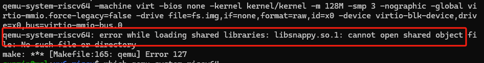

* 根据报错提示安装依赖

    ```
    sudo apt install libsnappy-dev libdaxctl-dev libvdeplug-dev
    ```

* 解决编译报错或依赖缺失问题后，重新编译

### xv6-riscv hello world

* hello, world


* 退出 qemu 快捷键
```
 Ctrl + A  X
 ```

### 在 qemu 中调试 xv6

- 在第一个命令窗口开启 gdb server

```
    make qemu-gdb
```
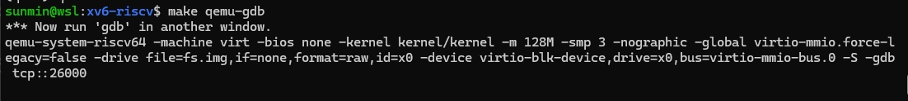


- 在第二个命令窗口 attatch gdb

```
    ~/bins/Xuantie-900-gcc-elf-newlib-x86_64-V2.2.4/bin/riscv64-unknown-elf-gdb

    target remote localhost:26000
```
- 查看 ehco 程序源码

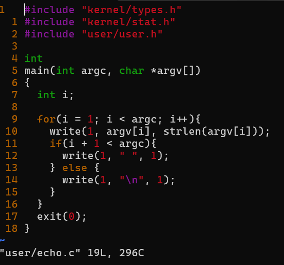

- 在 gdb 窗口里面设定调试代码及断点

```
#加载调试信息
file user/_echo

#设定断点
b user/echo.c:main

#继续执行
continue
```

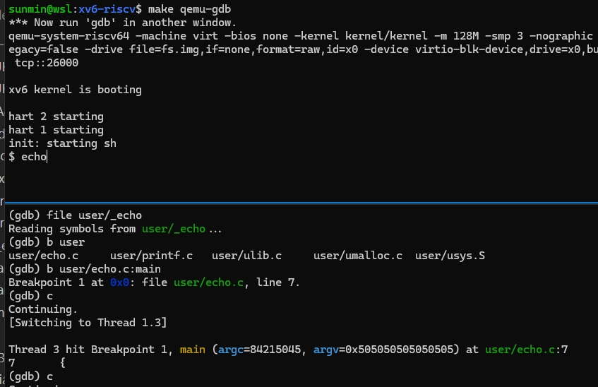


- 调试 echo 程序

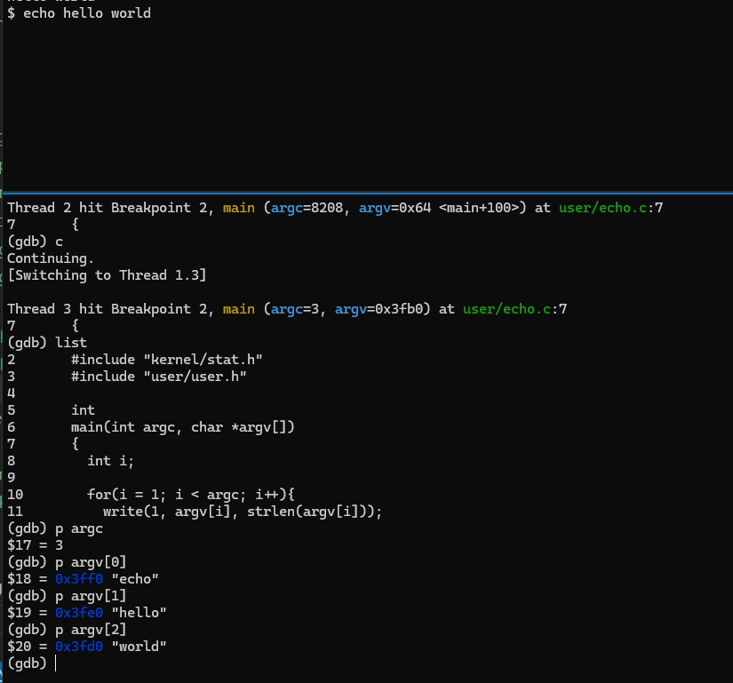

- 退出 qemu gdb

```
Ctrl + A C
#输入 quit 命令
quit
#敲击 Enter 键
Enter
```

## 总结